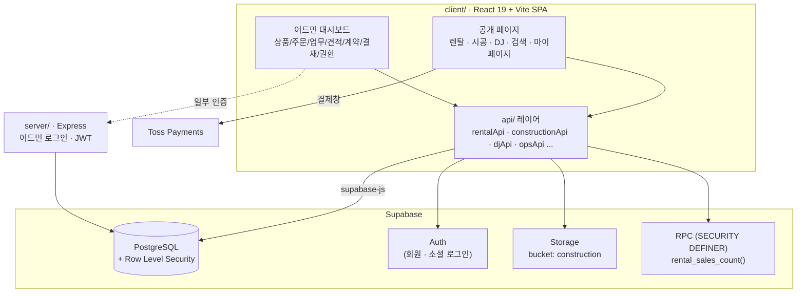
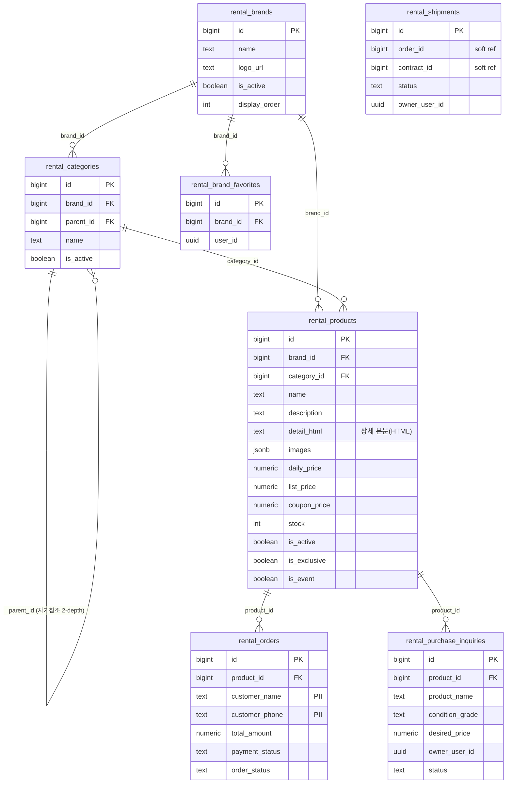
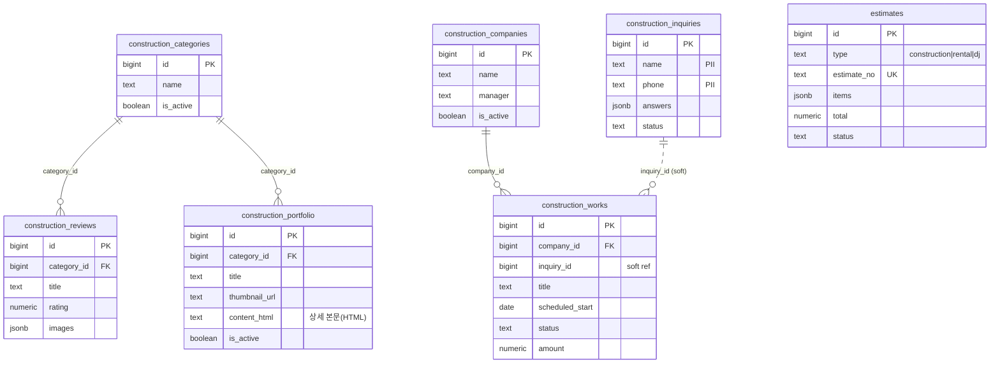
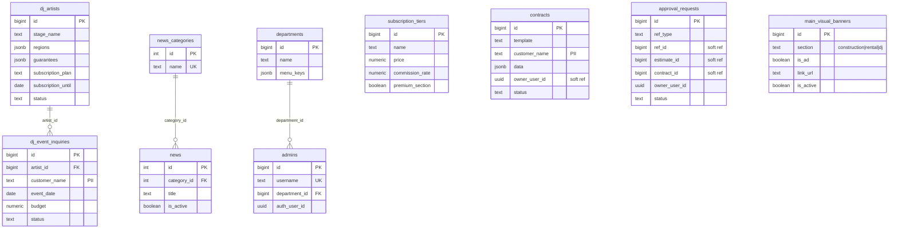

# Klipse — Fastival-Pages

음향·가구 **렌탈**, 인테리어 **시공**, **DJ/아티스트 매칭**을 하나로 묶은 통합 플랫폼입니다.
공개 쇼핑/문의 페이지와 운영 전반을 관리하는 어드민 대시보드(상품·주문·시공 업무·견적·계약·전자결재·권한 관리)로 구성됩니다.

- **Frontend (main):** React 19 + Vite + TypeScript (`client/`)
- **Backend-as-a-Service:** Supabase (PostgreSQL + RLS + Auth + Storage)
- **결제:** Toss Payments SDK
- **보조 서버:** Express (`server/`) — 어드민 로그인/JWT 등 일부 레거시 엔드포인트

> `backend/`, `frontend/` 는 초기 프로토타입 잔재이며 현재 활성 앱은 `client/` + `server/` + `supabase/` 입니다.

---

## 목차
- [아키텍처](#아키텍처)
- [디렉터리 계층 구조](#디렉터리-계층-구조)
- [도메인 모듈](#도메인-모듈)
- [데이터베이스 ERD](#데이터베이스-erd)
- [라우트 계층](#라우트-계층)
- [로컬 실행](#로컬-실행)
- [데이터베이스 마이그레이션](#데이터베이스-마이그레이션)
- [환경 변수](#환경-변수)

---

## 아키텍처



**설계 원칙**
- 클라이언트는 대부분 `supabase-js`로 DB에 직접 접근하고, 보안은 **RLS 정책**으로 강제합니다.
- 고객 PII 테이블(주문/문의 등)은 익명 사용자에게 `INSERT`만 허용하고 `SELECT`는 관리자 전용입니다. 공개 페이지에서 필요한 집계는 PII 없는 **`SECURITY DEFINER` RPC**로만 노출합니다.
- 목록/그리드 쿼리는 대용량 TEXT(`detail_html`, `content_html`)를 제외하고, 상세 조회에서만 전체 컬럼을 가져옵니다.

---

## 디렉터리 계층 구조

```
Fastival-Pages/
├─ client/                       # 메인 프론트엔드 (React 19 + Vite + TS)
│  └─ src/
│     ├─ api/                    # Supabase 접근 레이어 (도메인별 API 모듈)
│     │  ├─ core.ts              #   공통 run()/Result 래퍼
│     │  ├─ rentalApi.ts         #   렌탈: 브랜드·카테고리·상품·주문·문의·출고·관심
│     │  ├─ constructionApi.ts   #   시공: 카테고리·리뷰·포트폴리오·챗봇·문의
│     │  ├─ djApi.ts             #   DJ: 아티스트·이벤트 문의·구독 티어
│     │  ├─ opsApi.ts            #   운영: 업체·업무 현황·견적
│     │  ├─ contractApi.ts       #   전자계약
│     │  ├─ approvalApi.ts       #   전자결재(승인 요청)
│     │  ├─ mainVisualApi.ts     #   메인 비주얼/AD 배너
│     │  ├─ termsApi.ts · systemApi.ts · searchApi.ts · companyApi.ts
│     ├─ pages/
│     │  ├─ Rental/              # 렌탈 공개 페이지 (홈·목록·카테고리·브랜드·상세·결제)
│     │  ├─ Portfolio/ · Dj/ · CustomerCenter/ · MyPage/ · Auth/ · Terms/
│     │  ├─ SearchPage.tsx · ConstructionInquiry.tsx · Home.tsx
│     │  └─ admin/               # 어드민 대시보드
│     │     ├─ rental/ construction/ dj/ estimate/ contract/
│     │     ├─ inquiry/ main-visual/ subscription/ terms/ system/
│     ├─ components/             # 공용 UI (Header, Layout, UI/RichTextEditor ...)
│     ├─ lib/toss.ts             # Toss 결제 헬퍼
│     ├─ utils/imageUpload.ts    # 이미지 압축 + Storage 업로드
│     ├─ hooks/ · services/ · types/
│     └─ supabaseClient.ts
├─ server/                       # Express (어드민 로그인/JWT 등)
├─ supabase/
│  ├─ migrations/                # 스키마 마이그레이션 (46개+)
│  ├─ RUN_THIS_latest.sql        # 최신 변경 통합 실행본
│  ├─ functions/                 # Edge Functions
│  └─ config.toml
├─ backend/ · frontend/          # (레거시 프로토타입)
└─ package.json                  # 루트: concurrently 로 client+server 동시 실행
```

---

## 도메인 모듈

| 모듈 | 설명 | 대표 테이블 |
|---|---|---|
| **Rental (렌탈)** | 음향·가구 렌탈 쇼핑, 주문/결제, 중고 매입 입점, 출고 현황 | `rental_products`, `rental_orders`, `rental_shipments` |
| **Construction (시공)** | 시공 카테고리·포트폴리오·리뷰, 상담 챗봇, 시공 문의 | `construction_portfolio`, `construction_reviews`, `construction_inquiries` |
| **DJ / Artist** | DJ 아티스트 등록·구독, 행사 섭외 문의 | `dj_artists`, `dj_event_inquiries`, `subscription_tiers` |
| **Ops (운영)** | 시공 업체·업무 현황, 견적서 발행 | `construction_companies`, `construction_works`, `estimates` |
| **Workflow** | 전자계약, 전자결재(승인 요청) | `contracts`, `approval_requests` |
| **Content/Config** | 메인 비주얼 배너, 약관, 뉴스, 챗봇 질문 | `main_visual_banners`, `terms`, `news` |
| **Admin/RBAC** | 관리자 계정 · 부서별 메뉴 권한 | `admins`, `departments` |

---

## 데이터베이스 ERD

> PK = Primary Key, FK = Foreign Key. 일부 관계는 결합도를 낮추기 위해 **소프트 참조**(FK 없이 `type`+`id`로 연결)로 설계되어 있어 점선 주석으로 표기합니다.

### 1) 렌탈 도메인



### 2) 시공 도메인 + 운영



### 3) DJ · 워크플로 · 콘텐츠 · 권한



---

## 라우트 계층

```
공개(Public)
├─ /                         홈
├─ /rental                   렌탈 홈
│  ├─ /rental/best|exclusive|event|all   상품 목록(정렬/필터)
│  ├─ /rental/categories · /rental/brands 카테고리·브랜드 탐색
│  ├─ /rental/product/:id    상품 상세 (갤러리 + 리뷰/상세/추천 탭)
│  ├─ /rental/inquiry        중고 매입/입점 문의
│  └─ /rental/payment/success|fail        Toss 결제 결과
├─ /portfolio                시공 포트폴리오
├─ /construction/inquiry     시공 상담(챗봇)
├─ /dj ...                   DJ 매칭
├─ /search                   통합 검색
├─ /cs ...                   고객센터
├─ /mypage ...               마이페이지(주문·계약·출고)
└─ /login · /signup · /terms

어드민(Admin) — /admin/dashboard/**
├─ rental/        브랜드·카테고리·상품·주문·문의·출고
├─ construction/  카테고리·포트폴리오·리뷰·문의·챗봇
├─ dj/            아티스트·이벤트·통계
├─ estimate/ contract/       견적·전자계약
├─ inquiry/ approval          문의·전자결재
├─ main-visual/ subscription/ terms/
└─ system/        관리자 계정 · 부서/권한(RBAC)
```

---

## 로컬 실행

### 요구사항
- Node.js 18+ (권장 20+)
- Supabase 프로젝트 (URL / anon key)

### 설치 & 실행
```bash
# 루트에서 전체 의존성 설치 (root + client + server)
npm run install:all

# client(:5173) + server(:3000) 동시 실행
npm run dev

# client 만 실행하려면
cd client && npm run dev
```

### 빌드
```bash
cd client && npm run build      # tsc -b && vite build
```

---

## 데이터베이스 마이그레이션

스키마 변경은 **두 곳에 함께** 반영합니다.
1. `supabase/migrations/<timestamp>_<name>.sql` — 개별 마이그레이션
2. `supabase/RUN_THIS_latest.sql` — 최신 변경 통합 실행본 (Supabase SQL Editor에 붙여넣어 적용)

적용 방법(둘 중 하나):
```bash
# A. Supabase CLI
supabase db push

# B. 수동 — Supabase 대시보드 > SQL Editor 에서
#    RUN_THIS_latest.sql 의 최신 블록을 실행
```

최근 추가된 튜닝/기능 마이그레이션:
- `..._rental_sales_count_fn.sql` — 인기순 정렬용 집계 RPC(PII 비노출)
- `..._rental_product_detail_html.sql` — 상품 상세 본문 컬럼
- `..._perf_indexes.sql` — news / rental / construction 인덱스 추가

---

## 환경 변수

**client/.env**
```
VITE_SUPABASE_URL=...
VITE_SUPABASE_ANON_KEY=...
VITE_TOSS_CLIENT_KEY=...
```

**server/.env**
```
SUPABASE_URL=...
SUPABASE_SERVICE_ROLE_KEY=...
JWT_SECRET=...
PORT=3000
```

> 실제 키 이름은 `client/src/supabaseClient.ts`, `client/src/lib/toss.ts`, `server/index.js`를 확인하세요. `service_role` 키는 서버 전용이며 절대 클라이언트에 노출하지 마세요.
